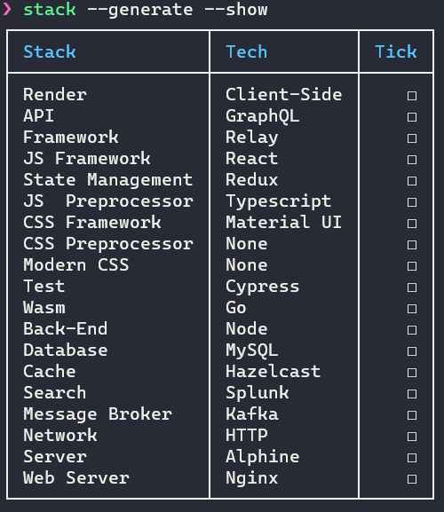

# Stack Idea

[](https://travis-ci.org/Nguyen-Hoang-Nam/stack-idea)
[](https://coveralls.io/github/Nguyen-Hoang-Nam/stack-idea)
[](https://github.com/xojs/xo)

Generate stack for your whole new idea.



## Prerequisite

- Node.js
- npm

## Installation

```bash
npm install -g stack-idea
```

## Usage

```bash
$ stack --help

  Usage
    $ stack <Options>

  Options
    -h, --help        Show help
    -v, --version     Show version
    -g, --generate    Generate stack base on [stack-config.json](./stack-config.json) and store in stack.json
    -s, --show        Show stack from stack.json
		-a, --all					Show all tech even remove one
		-t, --tick				Tick after setup tech successful
		-u, --untick			Untick when setup are not done yet
		-r, --remove			Remove tech that not use
		-G, --global			Use file stack.json in global

  Examples
    $ stack --generate --show
```

## Config

```stack``` by default has its own stack-config.json file. Therefore, when you want to customize, just create your own stack-config.json in your directory. Following config is default by the way:

```json
{
  "Render": [
    {
      "Name": "Server-Side"
    },
    {
      "Name": "Client-Side",
      "API": [
        {
          "Name": "REST"
        },
        {
          "Name": "GraphQL",
          "Framework": ["None", "Relay", "Apollo"]
        }
      ]
    }
  ],
  "JS Framework": [
    {
      "Name": "React",
      "State Management": ["Hooks", "Redux"]
    },
    {
      "Name": "Angular",
      "State Management": ["None", "RxJS", "NgRx"]
    },
    {
      "Name": "Vue",
      "State Management": ["None", "Vuex"]
    },
    {
      "Name": "Svelte",
      "State Management": ["None"]
    }
  ],
  "JS  Preprocessor": ["None", "Typescript"],
  "CSS Framework": ["None", "Material UI", "Tailwind CSS"],
  "CSS Preprocessor": ["None", "SCSS", "Stylus"],
  "Modern CSS": ["None", "Styled Component", "CSS Modules", "Emotion"],
  "Test": ["None", "Jest", "Cypress", "Enzyme"],
  "Wasm": ["None", "Rust", "Go", "C++"],
  "Back-End": ["Node", "Python", "Go"],
  "Database": [
    "Oracle",
    "MySQL",
    "PostgreSQL",
    "MongoDB",
    "Cassandra",
    "MariaDB",
    "Teradata",
    "Hive",
    "Neo4j"
  ],
  "Cache": ["Redis", "Memcached", "Hazelcast"],
  "Search": ["Elasticsearch", "Splunk", "Solr"],
  "Message Broker": ["None", "RabbitMQ", "Kafka"],
  "Network": ["HTTP", "HTTPS", "HTTP2"],
  "Server": ["Ubuntu", "Debian", "Alphine"],
  "Web Server": ["Nginx", "Apache", "Caddy"]
}
```

While some stacks can stand alone, others have dependencies such as *Apollo* framework may go with *GraphQL*. 

## Contributing

Pull requests are welcome. For major changes, please open an issue first to discuss what you would like to change.

Please make sure to update tests as appropriate.

## License

[MIT](https://choosealicense.com/licenses/mit/)
