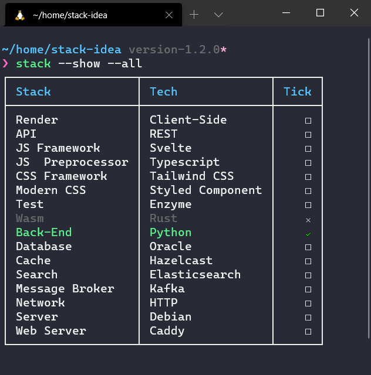
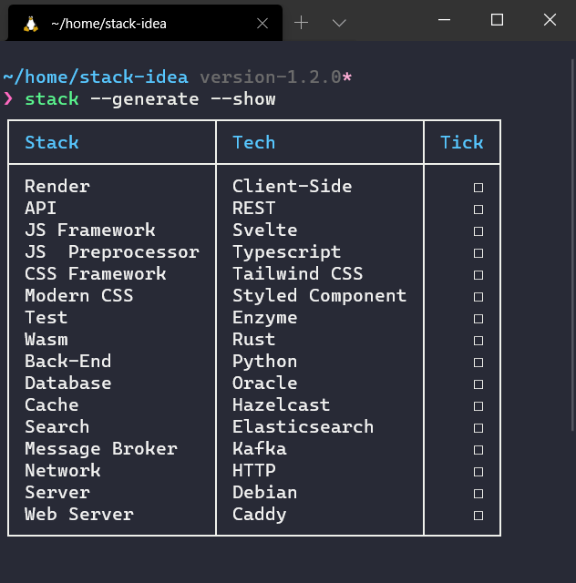
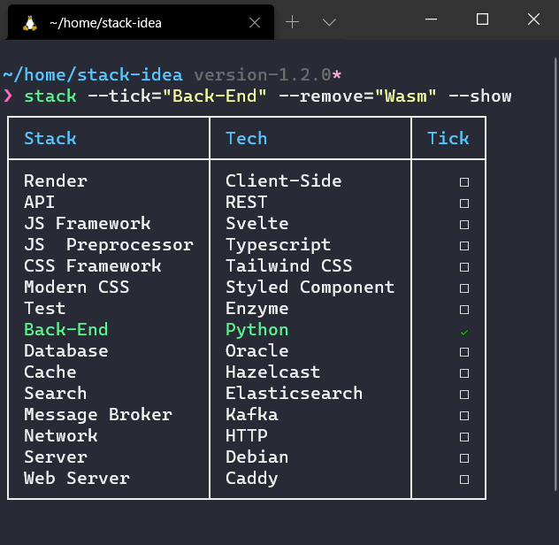

# Stack Idea

[](https://github.com/Nguyen-Hoang-Nam/stack-idea/actions)
[](https://coveralls.io/github/Nguyen-Hoang-Nam/stack-idea)
[](https://github.com/xojs/xo)
[](https://www.npmjs.com/package/stack-idea)

Generate random stack for your whole new idea.



## Prerequisite

- Node.js
- npm

## Installation

```bash
npm install -g stack-idea
```

```bash
yarn global add stack-idea
```

## Usage

```bash
$ stack --help

  Usage
    $ stack <Options>

  Options
    -h, --help        Show help
    -v, --version     Show version
    -g, --generate    Generate stack base on [stack-config.json](./stack-config.json) and store in stack.json
    -s, --show        Show stack from stack.json
    -a, --all         Show all tech even remove one
    -t, --tick        Tick after setup tech successful
    -u, --untick      Untick when setup are not done yet
    -r, --remove      Remove tech that not use
    -G, --global      Use file stack.json in global
    -y, --yaml        Use yaml file type instead of json
    -i, --item        Use to input array of parameter
    -n, --no          Not create out file
    --sort            Sort row of table

  Examples
    $ stack --generate --show
```

## Examples

### 1. Generate stack by default config

```bash
stack --generate
```

This command will generate a random stack and store in stack.json file in current directory.

```json
{
  "Render": {
    "Name": "Client-Side",
    "Tick": "untick"
  },
  "API": {
    "Name": "GraphQL",
    "Tick": "untick"
  },
  "Framework": {
    "Name": "Relay",
    "Tick": "untick"
  },
  "JS Framework": {
    "Name": "React",
    "Tick": "untick"
  },
  "State Management": {
    "Name": "Redux",
    "Tick": "untick"
  },
  "JS  Preprocessor": {
    "Name": "Typescript",
    "Tick": "untick"
  },
  "CSS Framework": {
    "Name": "Material UI",
    "Tick": "untick"
  },
  "CSS Preprocessor": {
    "Name": "None",
    "Tick": "untick"
  },
  "Modern CSS": {
    "Name": "None",
    "Tick": "untick"
  },
  "Test": {
    "Name": "Cypress",
    "Tick": "untick"
  },
  "Wasm": {
    "Name": "Go",
    "Tick": "untick"
  },
  "Back-End": {
    "Name": "Node",
    "Tick": "untick"
  },
  "Database": {
    "Name": "MySQL",
    "Tick": "untick"
  },
  "Cache": {
    "Name": "Hazelcast",
    "Tick": "untick"
  },
  "Search": {
    "Name": "Splunk",
    "Tick": "untick"
  },
  "Message Broker": {
    "Name": "Kafka",
    "Tick": "untick"
  },
  "Network": {
    "Name": "HTTP",
    "Tick": "untick"
  },
  "Server": {
    "Name": "Alphine",
    "Tick": "untick"
  },
  "Web Server": {
    "Name": "Nginx",
    "Tick": "untick"
  }
}
```

### 2. Generate stack in global

If you want to access stack wherever directory, just use option ```--global``` then stack will use stack.json file in global.

```bash
stack --generate --global
```

### 3. Show stack in terminal

This may be optional, you can use ```cat``` or your text editor to read stack.json file. This command can go with ```--generate``` and also supports ```--global```.

```bash
stack --show
```



### 4. Tick row in stack

If you think this stack like to do lists, you may find that check, uncheck and remove row are really useful to manipulate this list. In stack.json file, you can see there are 'Tick' property and default is 'untick'.

In convention, we define three states of row

- Untick: Empty check box, you might not done this row yet
- Tick: Check check box, you might done this row
- Remove: Remove this row, you might thought this row is not necessary in your stack

```bash
stack --tick="Back-End" --remove="Wasm"
```



### 5. Show all row in stack

When you remove row, it's no longer show in ```--show```. Therefore, use ```--all``` to view all rows.

```bash
stack --show --all
```

## Advance

### Usage
```bash
    --untick-all      Untick all row
    --unremove-all    Unremove all row
    --add-item        Add item to row in stack-config in global
    --remove-item     Remove item from row in stack-config in global
    --get-row        	Print all items of row in stack-config in global
    --add-row         Add row to stack-config in global
    --remove-row      Remove row from stack-config in global
    --hide-row        Hide row in stack-config in global
    --show-row        Show row that hide in stack-config in global
    --get-all         Print stack-config in global
```

### 6. Add item to row

You love Java but Back-End array doesn't has it, just add it to array.

```bash
stack --add-item="Back-End" --item="Java"
```

### 7. Remove row

Maybe, Wasm is not populate enough so you don't want to use it in your stack, just remove whole Wasm row.

```bash
stack --remove-row="Wasm"
```

## Config

```stack``` by default, has its own [stack-config.json](./stack-config.json) file. Therefore, when you want to customize, just create your own [stack-config.json](./stack-config.json) in your directory. Following config is default by the way:

```json
// stack-config.json
{
  "Render": [
    {
      "Name": "Server-Side"
    },
    {
      "Name": "Client-Side",
      "API": [
        {
          "Name": "REST"
        },
        {
          "Name": "GraphQL",
          "Framework": ["None", "Relay", "Apollo"]
        }
      ]
    }
  ],
  "JS Framework": [
    {
      "Name": "React",
      "State Management": ["Hooks", "Redux"]
    },
    {
      "Name": "Angular",
      "State Management": ["None", "RxJS", "NgRx"]
    },
    {
      "Name": "Vue",
      "State Management": ["None", "Vuex"]
    },
    {
      "Name": "Svelte",
      "State Management": ["None"]
    }
  ],
  "JS  Preprocessor": ["None", "Typescript"],
  "CSS Framework": ["None", "Material UI", "Tailwind CSS"],
  "CSS Preprocessor": ["None", "SCSS", "Stylus"],
  "Modern CSS": ["None", "Styled Component", "CSS Modules", "Emotion"],
  "Test": ["None", "Jest", "Cypress", "Enzyme"],
  "Wasm": ["None", "Rust", "Go", "C++"],
  "Back-End": ["Node", "Python", "Go"],
  "Database": [
    "Oracle",
    "MySQL",
    "PostgreSQL",
    "MongoDB",
    "Cassandra",
    "MariaDB",
    "Teradata",
    "Hive",
    "Neo4j"
  ],
  "Cache": ["Redis", "Memcached", "Hazelcast"],
  "Search": ["Elasticsearch", "Splunk", "Solr"],
  "Message Broker": ["None", "RabbitMQ", "Kafka"],
  "Network": ["HTTP", "HTTPS", "HTTP2"],
  "Server": ["Ubuntu", "Debian", "Alphine"],
  "Web Server": ["Nginx", "Apache", "Caddy"]
}
```

While some stacks can stand alone, others have dependencies such as *Apollo* framework may go with *GraphQL*.

## Contributing

Pull requests are welcome. For major changes, please open an issue first to discuss what you would like to change.

Please make sure to update tests as appropriate.

## License

[MIT](https://choosealicense.com/licenses/mit/)
